# Alex Zarazua -- Práctica Docker Compose

# INDEX
  * ¿Qué es Docker?
  * ¿Qué es Docker Compose?
  * Propósito del proyecto
  * Tecnologías Implicadas
  * Proceso de Desarrollo
  
##  ¿Qué es Docker?
  - La idea detrás de Docker es crear contenedores ligeros y portables para las aplicaciones software que puedan ejecutarse en cualquier máquina con Docker instalado, independientemente del sistema operativo que la máquina tenga por debajo, facilitando así también los despliegues.
##  ¿Qué es un Contenedor?
 - Digamos que son donde se almacena y empaqueta  todo lo necesario para que dicho software se ejecute.
Es algo auto contenido en sí, que se puede llevar de un lado a   otro de forma independiente, es portable.

##  ¿Cómo funciona Docker?
  La tecnología Docker usa el kernel de Linux y las funciones de este, como Cgroups y namespaces, para segregar los procesos, de modo que puedan ejecutarse de manera independiente.
  El propósito de los contenedores es esta independencia: la capacidad de ejecutar varios procesos y aplicaciones por separado para hacer un mejor uso de su infraestructura y, al mismo tiempo, conservar la seguridad que tendría con sistemas separados.
  Las herramientas del contenedor, como Docker, ofrecen un modelo de implementación basado en imágenes. Esto permite compartir una aplicación, o un conjunto de servicios, con todas sus dependencias en varios entornos.

## Ventajas de los contenedores Docker
* Modularidad
* Control de versiones de imágenes y capas
* Restauración
* Implementación rápida

## ¿Qué es Docker Compose?
   -  Docker compose es una herramienta desarrollada para ayudar a definir y compartir aplicaciones de varios contenedores. Con Compose, puede crear un archivo YAML para definir los servicios y, con un solo comando, ponerlo todo en marcha o eliminarlo.

La *gran ventaja*  de usar Compose es que puede definir la pila de la aplicación en un archivo, mantenerlo en la raíz del repositorio del proyecto (ahora tendrá control de versiones) y permitir que un tercero contribuya al proyecto. Un usuario solo tendría que clonar el repositorio e iniciar la aplicación Compose. 
De hecho, es posible que vea bastantes proyectos en GitHub/GitLab en los que se hace exactamente esto.

## Propósito del proyecto

El propósito de este proyecto será crear un sistema de monitorización con prometheus y grafana de peticiones a endpoints de un servidor nodejs.

## Proceso de Desarrollo

Para ello en primer lugar lo que haremos será arrancar un contenedor partiendo de un Dockerfile donde pondrá en marcha un sencillo servidor de express.

El dockerfile que hize es el siguiente : 
 * Partirá de una imagen de node (versión alpine3.10)
 * Establecerá un directorio de trabajo “myapp” donde residirá el código de la
aplicación.
 * Expondrá el puerto publicado por el servidor express.
 * Ejecutará como comando la instrucción necesaria para arrancar el servidor
express.

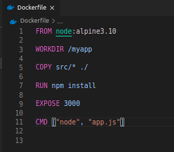

Arrancaremos el contenedor llamado (myapp_practica)  utilizando un docker-compose.yml como el que muestro en la captura: 

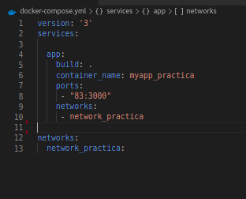

Dicho servicio se publicará en el puerto 83 y pertenece a una red común a todos los servicios denominada “network_practica”.
Y utilizamos el comando : ` sudo docker-compose up ` para crear y lanzar al mismo tiempo el contenedor

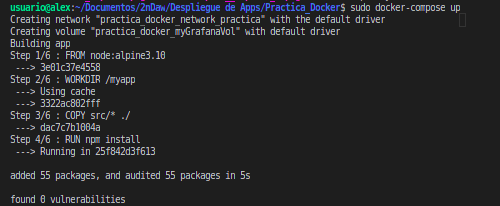

Como he mostrado anteriormente en la captura del docker-compose podemos visualizar que este servicio está corriendo en el puerto 83 de nuestra máquina, por lo tanto accedemos a dicho puerto:
localhost:83

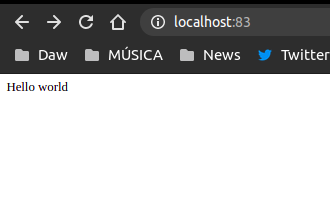

Nos sale el Hello World que anteriormente habíamos configurado,.
Lo que hice fue crear un sencillo app.js y con el comando ` npm init `  me genero un package.json muy simple para poder tener el express.

 * App.js

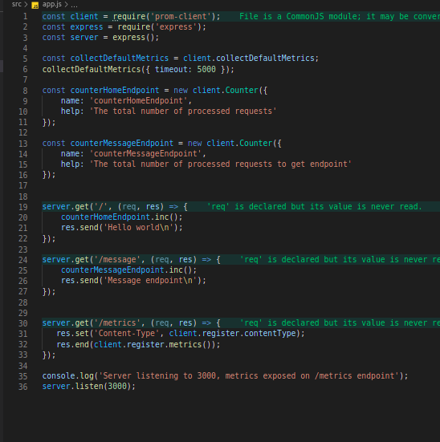

 * Package.json

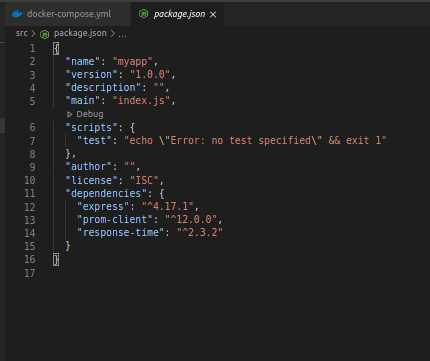

## En esta práctica también hemos utilizado Prometheus.

# ¿Qué es Prometheus?

Es una aplicación que nos permite recoger métricas de una aplicación en tiempo real. Como veréis en el ejemplo de app.js, se incluye una dependencia en el código ( prom-client) que permite crear contadores de peticiones que podemos asociar fácilmente a nuestros endpoints de manera que podemos saber cuántas veces se ha llamado a una función de nuestra api.

En nuestro caso, el servicio de prometheus se encargará de arrancar en el puerto 9090 de nuestro host un contenedor (prometheus_practica) basado en la imagen prom/prometheus:v2.20.1. Para poder configurar correctamente este servicio, será necesario realizar además dos acciones : 

Copiar el fichero adjunto prometheus.yml al directorio /etc/prometheus del
contenedor
Ejecutar el comando  ` --config.file=/etc/prometheus/prometheus.yml `

Para ello los pasos a seguir serán los siguientes : 

 *   Añadiremos un nuevo servicio a nuestro docker-compose.yml que ya teníamos.

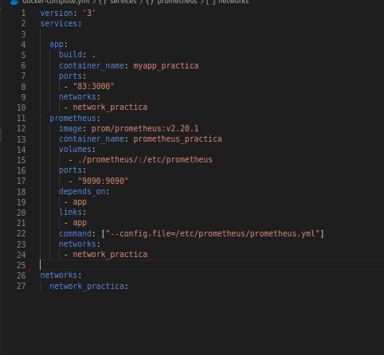

* El servicio responsable de arrancar la aplicación debe ejecutarse antes y el servicio deberá pertenecer a la red común “network_practica”.

* Volvemos a realizar el comando : ` sudo docker-compose up ` y nos dirigimos al puerto 9090 , localhost:9090 y nos aparecerá esta pantalla de inicio

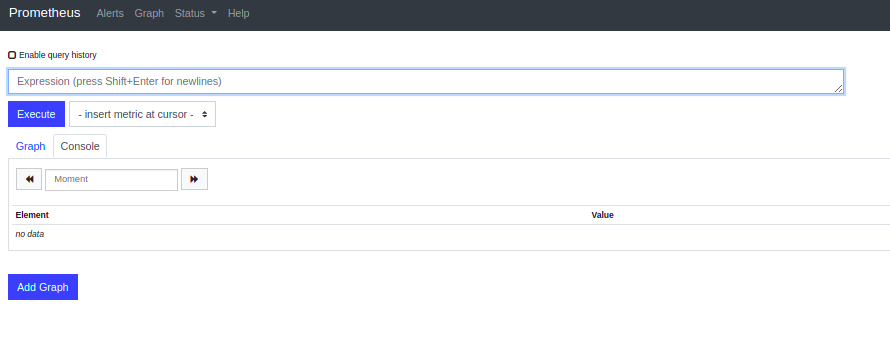

## ¿Qué es Grafana?

 * Grafana es un software libre basado en licencia de Apache 2.0, ​ que permite la visualización y el formato de datos métricos. Permite crear cuadros de mando y gráficos a partir de múltiples fuentes, incluidas bases de datos de series de tiempo como Graphite, InfluxDB y OpenTSDB.

 * Además de las utilidades mencionadas con anterioridad, recalcar que la herramienta también nos permite consultar información de negocio, como es el gasto en infraestructura en tiempo real, e incluso integrar gráficas de negocio del propio cliente.

* Todo ello posiciona al cliente ante una situación muy favorable de cara a poder gestionar de forma eficiente su infraestructura y servicios, permitiéndole anticipar posibles incidencias y reducir costes.

*   *También recalcar que está escrito en Go.*

## Forma de proceder con el cliente

* Con el objetivo de acceder a la plataforma y visualizar la información deseada, la forma de proceder entre Ackstorm y el cliente es la siguiente:

* Se proporciona la clave de acceso al cliente a su plataforma.
Una vez accede al sistema, un panel general recoge y visualiza los datos más relevantes de su plataforma.
Des de ahí, el cliente puede navegar entre los distintos paneles disponibles y consultar recursos de una forma totalmente visual e intuitiva.

* En nuestro caso, el servicio de grafana se encargará de arrancar en el puerto 3500 de nuestro host un contenedor (grafana_practica) basado en la imagen grafana/grafana:7.1.5 que, además, se caracterizará por:
    - Establecer las variables de entorno necesarias para:
    - Deshabilitar el login de acceso a Grafana
    - Permitir la autenticación anónima
    - Que el rol de autenticación anónima sea Admin
    - Que instale el plugin grafana-clock-panel 1.0.1
    - Pertenece a la red común “network_practica”
    - Dispondrá de un volumen nombrado (myGrafanaVol) que          permitirá almacenar
    los cambios en el servicio ya que se asociará con el directorio /var/lib/grafana

* Añadimos a nuestro compose el servicio de grafana:

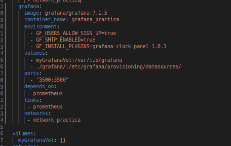

* *Para una correcta configuración de Grafana, será necesario realizar la copia
del fichero adjunto datasources.yml al directorio del contenedor
/etc/grafana/provisioning/datasources/.*

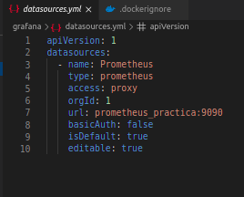

### Por lo que nuestro compose quedaría de la siguiente manera :
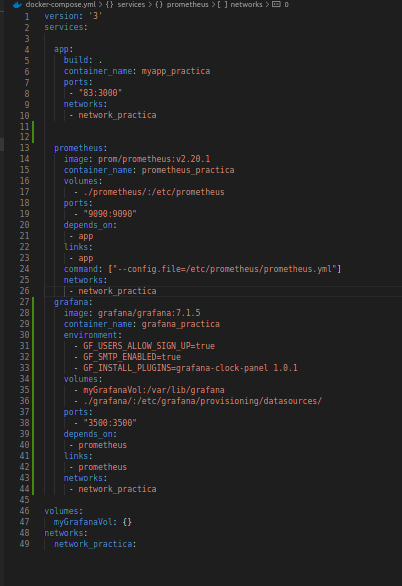

Como hemos hecho anteriormente volvemos a realizar el comando :
 ` sudo docker-compose up `.
Se accede correctamente a la aplicación que se ejecuta en el contenedor a través del
puerto 83

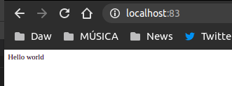

- Se accede correctamente a Prometheus en el puerto 9090 y que en el apartado Status
- Targets muestran el acceso correcto a las métricas capturadas en la app.

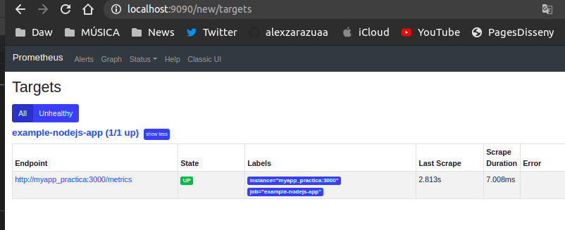