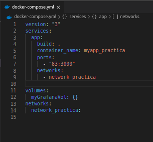
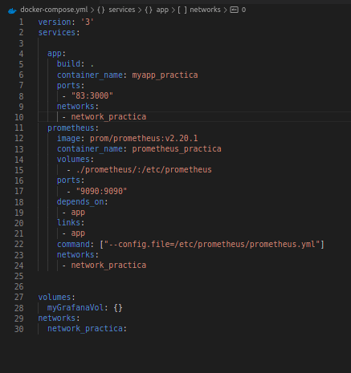

# Alex Zarazua -- Práctica Docker Compose

##  El propósito de este proyecto será un sistema de monitorización con prometheus y grafana de peticiones a endpoints de un servidor nodejs.

Para ello en primer lugar lo que haremos será arrancar un contenedor partiendo de un Dockerfile donde pondrá en marcha un sencillo servidor de express.

El dockerfile que hize es el siguiente : 
 * Partirá de una imagen de node (versión alpine3.10)
 * Establecerá un directorio de trabajo “myapp” donde residirá el código de la
aplicación.
 * Expondrá el puerto publicado por el servidor express.
 * Ejecutará como comando la instrucción necesaria para arrancar el servidor
express.

Arrancaremos el contenedor llamado (myapp_practica)  utilizando un docker-compose.yml como el que muestro en la captura: 

Dicho servicio se publicará en el puerto 83 y pertenece a una red común a todos los servicios denominada “network_practica”.
Y utilizamos el comando : sudo docker-compose up para crear y lanzar al mismo tiempo el contenedor

Como he mostrado anteriormente en la captura del docker-compose podemos visualizar que este servicio está corriendo en el puerto 83 de nuestra máquina, por lo tanto accedemos a dicho puerto:
localhost:83

Nos sale el Hello World que anteriormente habíamos configurado,.
Lo que hice fue crear un sencillo app.js y con el comando npm init me genero un package.json muy simple para poder tener el express.

App.js
PONER LA IMAGEN

Package.json

## En esta práctica también hemos utilizado Prometheus.

# ¿Qué es Prometheus?

Es una aplicación que nos permite recoger métricas de una aplicación en tiempo real. Como veréis en el ejemplo de app.js, se incluye una dependencia en el código ( prom-client) que permite crear contadores de peticiones que podemos asociar fácilmente a nuestros endpoints de manera que podemos saber cuántas veces se ha llamado a una función de nuestra api.

En nuestro caso, el servicio de prometheus se encargará de arrancar en el puerto 9090 de nuestro host un contenedor (prometheus_practica) basado en la imagen prom/prometheus:v2.20.1. Para poder configurar correctamente este servicio, será necesario realizar además dos acciones : 

Copiar el fichero adjunto prometheus.yml al directorio /etc/prometheus del
contenedor
Ejecutar el comando --config.file=/etc/prometheus/prometheus.yml

Para ello los pasos a seguir serán los siguientes : 

 *   Añadiremos un nuevo servicio a nuestro docker-compose.yml que ya teníamos.

* El servicio responsable de arrancar la aplicación debe ejecutarse antes y el servicio deberá pertenecer a la red común “network_practica”.

* Volvemos a realizar el comando : sudo docker-compose up y nos dirigimos al puerto 9090 , localhost:9090 y nos aparecerá esta pantalla de inicio
